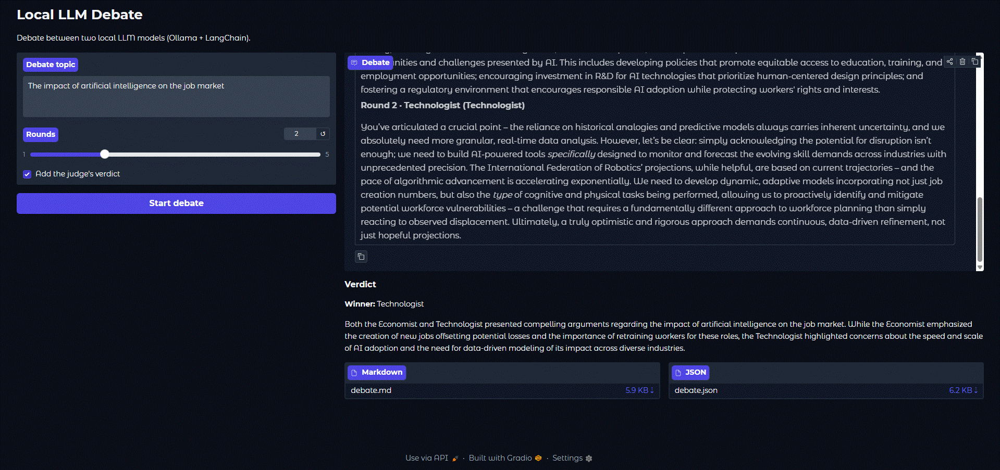
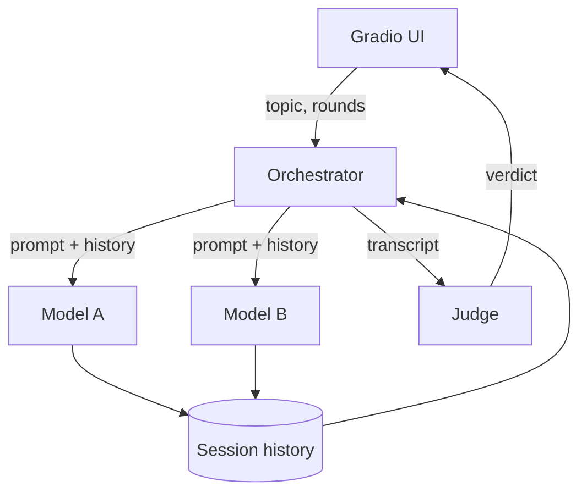

# Local LLM Debate

Two local models argue a topic in turns and a third one acts as judge and picks
a winner. Everything runs through Ollama on your own machine — no API keys,
nothing leaves your computer.

Each model gets a role through its system prompt (economist, technologist,
whatever), you give it a topic, and they go back and forth for a few rounds.
There's a small Gradio app to run it and download the result as Markdown or JSON.

<!-- Replace with a real screenshot/GIF before publishing. -->


## How it works



The orchestrator keeps one shared history per session and, each round, every
model answers seeing what's been said so far. Models are described by a
`ModelConfig` and their Ollama client is created lazily on first use, so nothing
connects until a debate actually runs. Swapping the backend only touches one
place: the code just assumes the client has `.invoke()`. When the rounds are
done, a separate judge model reads the transcript and returns a verdict.

## Run it

You need [Ollama](https://ollama.com/download) with the models pulled:

```bash
ollama pull mistral
ollama pull gemma3
```

Then:

```bash
git clone https://github.com/tricio91/LlmsConversation.git
cd LlmsConversation
python -m venv .venv && source .venv/bin/activate   # Windows: .venv\Scripts\activate
pip install -r requirements.txt
cp .env.example .env
python app/gradio_app.py
```

Open the local URL it prints and start a debate.

## From code

```python
from llm_conversation import ConversationOrchestrator, Judge, build_default_roster, to_markdown

orchestrator = ConversationOrchestrator(build_default_roster())
result = orchestrator.run("The impact of AI on the job market", rounds=2)
print(to_markdown(result, Judge().evaluate(result)))
```

## Adding a model

Add another `ModelConfig` in `build_default_roster()` (`src/llm_conversation/models.py`):

```python
ModelConfig(
    name="Philosopher",
    role="Philosopher",
    model_id="llama3",
    system_prompt="You are an ethical philosopher. You question everyone's assumptions...",
)
```
